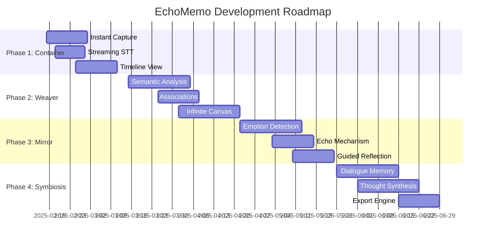

# EchoMemo Technical Roadmap / 技术路线图

**Last Updated**: 2025-02-15
**Version**: v1.0.0

---

## 🗺️ Technology Evolution Timeline / 技术演进时间线



---

## Phase 1 Technology Stack / 第一阶段技术栈

### Frontend / 前端

| Component / 组件 | Technology / 技术 | Version / 版本 |
|------------------|------------------|---------------|
| **Framework** / 框架 | Flutter | 3.41+ |
| **State Management** / 状态管理 | Provider | ^6.0.0 |
| **Audio Recording** / 音频录制 | flutter_sound | ^9.0.0 |
| **Waveform Visualization** / 波形可视化 | Custom + CustomPainter | - |
| **WebSocket Client** / WebSocket客户端 | web_socket_channel | ^2.4.0 |
| **Encryption** / 加密 | encrypt | ^5.0.0 |
| **Secure Storage** / 安全存储 | flutter_secure_storage | ^8.0.0 |
| **Local Storage** / 本地存储 | path_provider | ^2.1.0 |
| **HTTP Client** / HTTP客户端 | dio | ^5.0.0 |

### Backend / 后端

| Component / 组件 | Technology / 技术 | Version / 版本 |
|------------------|------------------|---------------|
| **Framework** / 框架 | FastAPI | 0.104+ |
| **WebSocket** | websockets | 11.0+ |
| **STT Service** | Volcengine / OpenAI | - |
| **LLM Service** | DeepSeek | - |
| **Database** | PostgreSQL | 15 |
| **ORM** | SQLAlchemy | 2.0+ |
| **Task Queue** | BackgroundTasks | - |

### Infrastructure / 基础设施

```yaml
Phase 1 Infrastructure:
  Compute:
    - Backend: Docker containers on VPS
    - Database: Managed PostgreSQL (or Docker)
  Storage:
    - Audio: Encrypted local storage (device)
    - Backups: Optional cloud sync
  Network:
    - API: REST + WebSocket
    - Latency Target: <300ms STT
```

---

## Phase 2 Technology Additions / 第二阶段技术新增

### New Dependencies / 新依赖

#### Frontend / 前端

```yaml
# pubspec.yaml additions
dependencies:
  flutter_zoom_drawer: ^3.0.0  # Infinite canvas navigation
  custom_draggable_widget: ^1.0.0  # Drag capsules
  graphview: ^1.0.0  # Mind map visualization
```

#### Backend / 后端

```python
# requirements.txt additions
langchain==0.1.0
langchain-openai==0.0.2
openai==1.0.0
faiss-cpu==1.7.4  # Vector similarity
redis==5.0.0  # Embedding cache
sentence-transformers==2.2.0  # Local embeddings
```

### Architecture Changes / 架构变更

```
Phase 2 Backend Architecture:

FastAPI
  ├─ API Routes
  │   ├─ /v1/capsules (CRUD)
  │   ├─ /v1/summarize (LLM)
  │   └─ /v1/associations (Semantic)
  │
  ├─ Services Layer
  │   ├─ SemanticAnalysisService
  │   ├─ KnowledgeGraphService
  │   └─ EmbeddingService
  │
  └─ Infrastructure
      ├─ Vector Store (FAISS)
      ├─ Cache (Redis)
      └─ Queue (Celery/Redis)
```

---

## Phase 3 Technology Additions / 第三阶段技术新增

### New Dependencies / 新依赖

```python
# requirements.txt additions
librosa==0.10.0  # Audio analysis
vaderSentiment==3.3.2  # Sentiment analysis
scikit-learn==1.3.0  # ML models
transformers==4.30.0  # PyTorch models
torch==2.0.0  # Deep learning
apscheduler==3.10.0  # Scheduled tasks
```

### Machine Learning Models / 机器学习模型

| Model / 模型 | Purpose / 用途 | Framework / 框架 |
|--------------|---------------|-----------------|
| **Emotion Detection** / 情绪检测 | Custom CNN + Audio features | PyTorch |
| **Sentiment Analysis** / 情感分析 | VADER (rule-based) | NLTK |
| **Activity Detection** / 活动检测 | Random Forest | scikit-learn |
| **CBT Question Generator** / CBT问题生成 | LLM (Fine-tuned) | OpenAI/DeepSeek |

---

## Phase 4 Technology Additions / 第四阶段技术新增

### New Dependencies / 新依赖

```python
# requirements.txt additions
langchain==0.1.0
langchain-community==0.0.10
chromadb==0.4.0  # Vector database
weasyprint==59.0  # PDF generation
python-docx==0.8.11  # Word export
markdown==3.5.0  # Markdown processing
```

### LLM Integration Strategy / LLM集成策略

```python
# Phase 4 LLM Requirements

LLM_SPECIFICATIONS = {
    "context_window": "32K+ tokens",  # Remember long conversations
    "model": "GPT-4-Turbo or Claude 3 Opus",
    "temperature": "0.7-0.9",  # Creative but coherent
    "max_tokens": "1000 per response",
    "tools": [
        "function_calling",  # For structured outputs
        "retrieval",  # Access past conversations
        "memory",  # Long-term conversation memory
    ]
}
```

---

## Cross-Phase Technical Decisions / 跨阶段技术决策

### 1. Data Migration Strategy / 数据迁移策略

```python
# Database migrations per phase
# backend/migrations/

migrations/
├── 001_initial_schema.py          # Phase 1
├── 002_add_summaries.py            # Phase 2
├── 003_add_semantic_associations.py # Phase 2
├── 004_add_emotion_analysis.py     # Phase 3
├── 005_add_reflection_sessions.py  # Phase 3
├── 006_add_dialogue_memory.py      # Phase 4
└── 007_add_synthesis_tables.py     # Phase 4
```

### 2. API Versioning Strategy / API版本策略

```python
# API versioning allows gradual rollout

API_VERSIONS = {
    "v1": "Phase 1 - Basic CRUD",
    "v2": "Phase 2 - Semantic features",
    "v3": "Phase 3 - Emotion & Reflection",
    "v4": "Phase 4 - Dialogue & Synthesis",
}

# All versions run simultaneously
# Clients can upgrade at their own pace
```

### 3. Performance Targets / 性能目标

| Metric / 指标 | Phase 1 | Phase 2 | Phase 3 | Phase 4 |
|--------------|---------|---------|---------|---------|
| **App Launch** / 应用启动 | ≤1.5s | ≤2.0s | ≤2.5s | ≤3.0s |
| **STT Latency** / STT延迟 | ≤300ms | ≤300ms | ≤300ms | ≤300ms |
| **Query Response** / 查询响应 | ≤500ms | ≤1s | ≤2s | ≤3s |
| **Memory Usage** / 内存使用 | ≤200MB | ≤300MB | ≤400MB | ≤500MB |

### 4. Scaling Strategy / 扩展策略

```
Phase 1-2: Single VPS (4-8 GB RAM)
  └─ Sufficient for <1000 users

Phase 3: Load balancer + 2 backend servers
  ├─ API server 1 (handles recording)
  └─ API server 2 (handles analysis)

Phase 4: Microservices architecture
  ├─ API Gateway
  ├─ Dialogue Service (GPU instance for LLM)
  ├─ Analysis Service (CPU)
  ├─ Storage Service (CDN)
  └─ Database cluster (Primary + Replicas)
```

---

## Technology Debt Management / 技术债务管理

### Phase 1→2 Migration / 第一阶段到第二阶段迁移

**Refactoring Needed / 需要重构**:
1. Extract audio recording into service / 提取音频录制到服务
2. Abstract STT service for multiple providers / 抽象STT服务以支持多个提供商
3. Add pagination to timeline / 为时间流添加分页

**Estimated Time / 预估时间**: 3-5 days

### Phase 2→3 Migration / 第二阶段到第三阶段迁移

**Refactoring Needed / 需要重构**:
1. Implement caching layer (Redis) / 实现缓存层
2. Add async task queue / 添加异步任务队列
3. Optimize database queries / 优化数据库查询

**Estimated Time / 预估时间**: 5-7 days

### Phase 3→4 Migration / 第三阶段到第四阶段迁移

**Refactoring Needed / 需要重构**:
1. Migrate to microservices / 迁移到微服务
2. Implement proper logging / 实施适当的日志记录
3. Add monitoring & alerting / 添加监控和警报

**Estimated Time / 预估时间**: 7-10 days

---

## Security Considerations / 安全考虑

### End-to-End Encryption / 端到端加密

```python
# Phase 1: Local encryption only
ENCRYPTION_STRATEGY = {
    "audio": "AES-256-GCM (device key)",
    "transcription": "At rest (DB)",
    "transmission": "TLS 1.3"
}

# Phase 2: Add E2EE option
ENCRYPTION_STRATEGY.update({
    "transcription": "Optional E2EE",
    "cloud_backup": "Encrypted with user key"
})

# Phase 3-4: Zero-knowledge architecture
ENCRYPTION_STRATEGY.update({
    "all_user_data": "Client-side encryption",
    "server_sees": "Only encrypted blobs"
})
```

---

## Monitoring & Observability / 监控和可观察性

### Metrics to Track / 要跟踪的指标

```python
# backend/services/telemetry.py

METRICS = {
    "performance": {
        "app_launch_time": "Histogram",
        "stt_latency": "Histogram",
        "api_response_time": "Histogram",
    },
    "engagement": {
        "recordings_per_user": "Counter",
        "session_duration": "Histogram",
        "feature_usage": "Counter",
    },
    "errors": {
        "app_crashes": "Counter",
        "api_errors": "Counter",
        "stt_failures": "Counter",
    },
    "business": {
        "dau_wau_mau": "Gauge",  # Daily/Weekly/Monthly active
        "retention_cohorts": "Table",
        "conversion_funnel": "Counter",
    }
}
```

---

## Cost Projections / 成本预估

### Infrastructure Costs / 基础设施成本 (Monthly / 月)

| Phase / 阶段 | VPS | Database | Storage | APIs | Total / 总计 |
|------------|-----|----------|---------|------|-------------|
| **Phase 1** | $20 | $15 | $5 | $30 | $70/月 |
| **Phase 2** | $40 | $30 | $10 | $50 | $130/月 |
| **Phase 3** | $80 | $50 | $20 | $80 | $230/月 |
| **Phase 4** | $200 | $100 | $40 | $200 | $540/月 |

*Costs scale with user count / 成本随用户数量扩展*

---

## Technology Alternatives / 技术替代方案

### STT Options / STT选项

| Provider / 提供商 | Cost / 成本 | Accuracy / 准确性 | Latency / 延迟 |
|------------------|------------|------------------|---------------|
| **Volcengine** (Current) | $0.05/min | High (Chinese) | <300ms |
| **OpenAI Whisper** | $0.006/min | Very High | <500ms |
| **Google Speech-to-Text** | $0.006/min | High | <200ms |
| **Azure Speech** | $1/hour | High | <150ms |

### LLM Options / LLM选项

| Provider / 提供商 | Cost / 成本 | Context / 上下文 | Speed / 速度 |
|------------------|------------|-----------------|-------------|
| **DeepSeek** (Current) | $0.14/M tokens | 16K | Fast |
| **OpenAI GPT-4** | $10/M tokens | 32K | Medium |
| **Anthropic Claude** | $3/M tokens | 100K | Fast |
| **Local LLaMA** | $0 (hardware) | 4K | Slow |

---

## Risk Mitigation / 风险缓解

### Technical Risks / 技术风险

| Risk / 风险 | Probability / 概率 | Impact / 影响 | Mitigation / 缓解 |
|------------|-------------------|--------------|-----------------|
| **STT API downtime** | Medium | High | Fallback to multiple providers |
| **LLM rate limits** | High | Medium | Implement caching & queuing |
| **Database scaling** | Medium | High | Plan sharding from Phase 1 |
| **Mobile app rejection** | Low | Critical | Follow platform guidelines strictly |

---

## Next Steps / 下一步

1. **Complete Phase 1 Task Breakdown** / 完成第一阶段任务分解
   → See [phase-01-container.md](../phases/phase-01-container.md)

2. **Set up Development Environment** / 建立开发环境
   → See [DEPLOYMENT.md](../../DEPLOYMENT.md)

3. **Initialize Progress Tracking** / 初始化进度追踪
   → See [progress-tracker.md](../tracking/progress-tracker.md)

---

**Document Version**: v1.0.0
**Last Updated**: 2025-02-15
**Next Review**: End of Phase 1
